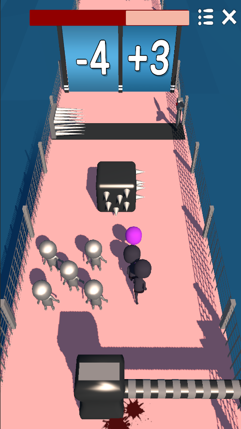
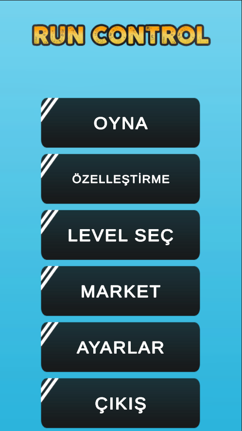
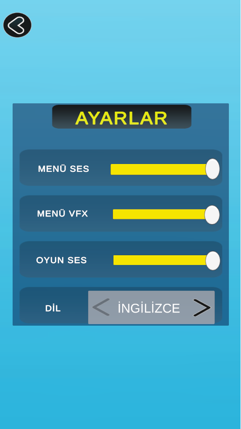
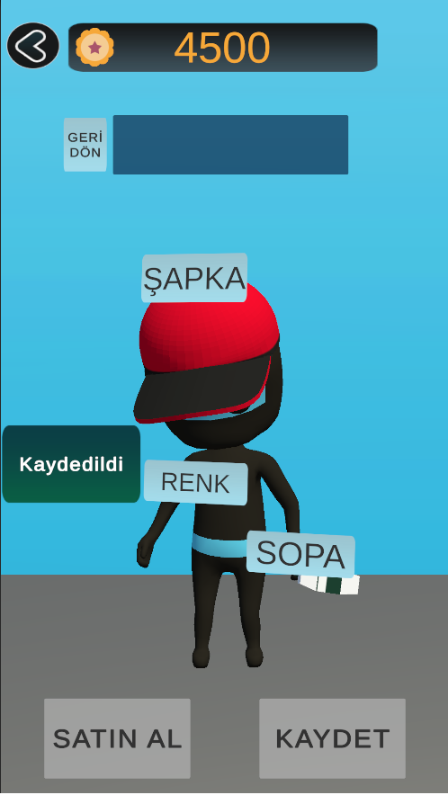
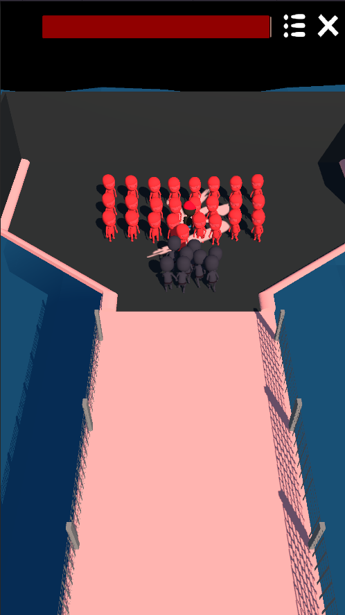
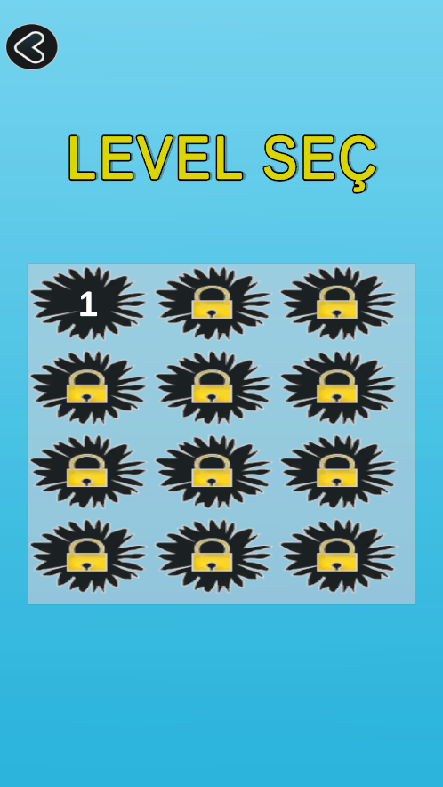

# GATHER RUN

>  **My First Hyper-Casual Mobile Game Project**
>
> This project is my first hyper-casual mobile game, developed using Unity and C#. It serves as a portfolio piece created with the goal of learning fundamental mobile game mechanics, UI design, and optimization processes.

##  Project Aim & Concept

Gather Run is a fast-paced and fun hyper-casual game where players grow their crowd by interacting with objects while progressing through the level. The primary objective is to use this gathered force to clash with enemies at the end of the level, emerging victorious by surviving with the largest possible crowd.

My main goals during this project were:

* To complete an end-to-end mobile game development cycle.
* To apply User Interface (UI) and User Experience (UX) principles.
* To design simple yet addictive mechanics, a hallmark of hyper-casual games.

##  Key Features & Learnings

I focused on developing the following systems for this project:

* ** Comprehensive Character Customization:** A system allowing players to personalize their characters with:
    * Interchangeable hats.
    * Various material/color options.
    * Different skins for the character's stick.

* ** Level Progression System:** A level selection menu that tracks player progress and unlocks new stages.

* ** Multi-Language Support:** Localization support (for English and Turkish) to adapt the game for a wider audience.

##  Current Status & Future Plans

Please note that this project is currently a **work-in-progress prototype**. It primarily demonstrates the core mechanics, customization systems, and UI structure I've built.

My immediate development roadmap includes:

* * Mobile-Friendly Controls:** Implementing intuitive touch controls (e.g., swipe/joystick) for the mobile experience.
* ** Market System:** Building a complete in-game shop to unlock or purchase customization items.
* ** AdMonetization:** Integrating an ad service (like AdMob) for rewarded and interstitial ads.
* ** Level Design:** Expanding the game with more diverse, challenging, and polished levels.

## 📸 Screenshots

Visuals showcasing the project's current state:

### 1. Main Menu & Settings
| Main Menu | Settings |
| :---: | :---: |
|  |  |

### 2. Character Customization Screen
(This screen shows the customization options for the player.)

### 3. Gameplay Moments
| Gameplay | End Game |
| :---: | :---: |
|  |  |

### 4. Level Selection Menu

